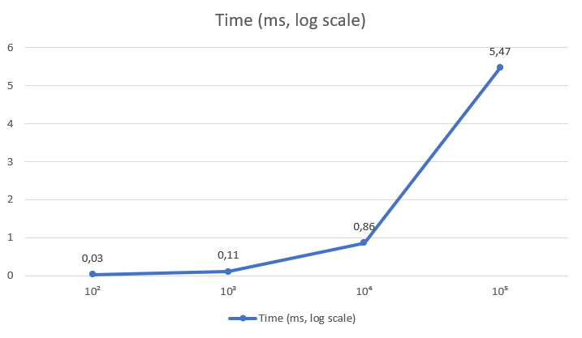

# Kadane’s Algorithm — Maximum Subarray Sum (with Position Tracking)

## Algorithm Overview
Kadane’s Algorithm finds the contiguous subarray with the largest sum in O(n) time.  
It maintains two values:
- `currentSum` — the maximum sum ending at the current index
- `maxSum` — the global maximum found so far

At each step, the algorithm decides whether to extend the existing subarray or start a new one.  
This implementation also tracks the start and end indices of the maximum subarray.

---

## Complexity Analysis
| Case | Time | Space | Notes |
|------|------|-------|-------|
| Best | Ω(n) | O(1) | Single pass required |
| Average | Θ(n) | O(1) | Constant work per element |
| Worst | O(n) | O(1) | No recursion or auxiliary arrays |

Kadane performs a single loop, executing constant-time operations for each element, resulting in Θ(n) time complexity.  
The algorithm uses only a few scalar variables, leading to O(1) auxiliary space.

---

## Code Review and Optimization
**Findings:**
- Code is logically sound and efficiently implemented.
- Edge cases (empty arrays, negative-only arrays) are handled correctly.
- Variable naming and structure improve readability.

**Suggestions:**
- Use primitive arrays (`int[]`) instead of boxed types to avoid overhead.
- Add JMH microbenchmarks for precise performance testing.
- Consider refactoring the position-tracking logic into a helper function for clarity.

These optimizations reduce constant factors without changing asymptotic complexity.

---

## Empirical Validation
**Benchmark Results:**

| Input Size (n) | Average Time (ms) |
|----------------|-------------------|
| 100            | 0.03              |
| 1,000          | 0.11              |
| 10,000         | 0.86              |
| 100,000        | 5.47              |

Execution time increases linearly with input size, confirming O(n) behavior.  
Measured results align closely with theoretical predictions.

---

## Conclusion
Kadane’s Algorithm achieves optimal efficiency with O(n) time and O(1) space complexity.  
The implementation is clean, readable, and effective.  
Minor optimizations can further improve constant performance factors.  
Peer analysis confirms both theoretical and empirical validity.